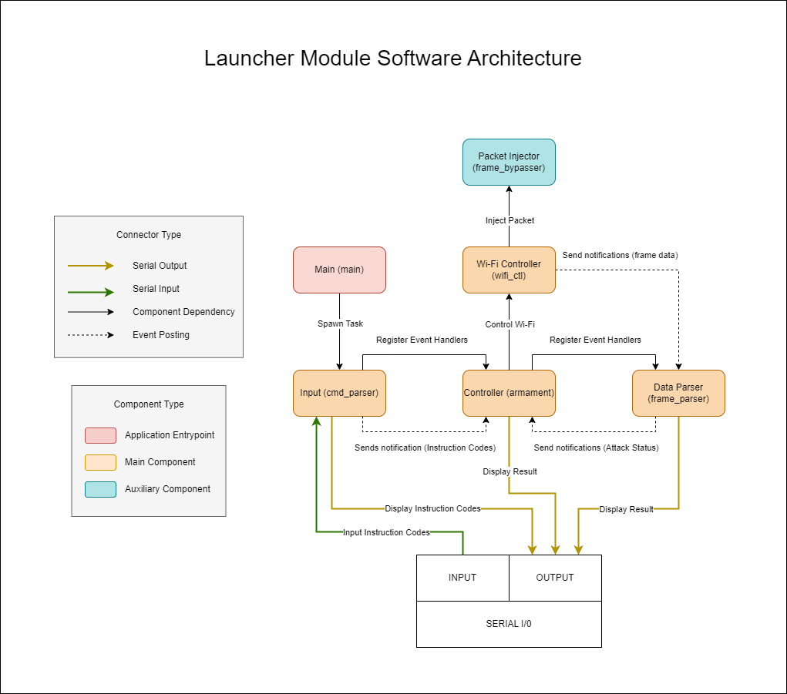

# AWPS (Automatic Wi-Fi Penetration System) Launcher Module

In an age where wireless connectivity reigns supreme, the security of our wireless networks has become paramount. Enter the Automatic WiFi Penetration System, or AWPS, a creative solution designed to penetrate most Wifi enabled devices that is using WPA2. AWPS leverages the formidable capabilities of the ESP32 microcontroller to perform a crucial task in penetrating a Wifi network: capturing critical data elements when a STA initiated authentication with the AP. 

Capturing critical data elements, the PMKID and MIC enables us to conduct offline brute force attacks, facilitating the identification of the PSK.

## Launcher Module

The ESP32 microcontroller, serving as our Launcher Module, assumes the pivotal role of executing attacks upon receiving command inputs via serial communication. It offers two control modes: direct serial user input commands or through a high-level command and control module. As the Launcher Module prioritizes simplicity, it refrains from validating user input commands. Therefore, for optimal functionality, it is recommended to pair the Launcher Module with an external command and control module.

The AWPS Command Launch Module is a command and control module that stands as an Android application software meticulously crafted to offer a simple interface facilitating seamless interaction with the Launcher Module. This application boasts a user-friendly interface that empowers users to initiate attacks with a single click, closely monitor the status of ongoing operations, and efficiently organize the comprehensive data accrued during each penetration session. The Command Launch Module facilitates automated operation in penetrating the Wi-Fi device. A Command Launch Module, in general parlance, refers to a command and control device designed to exercise control over the launcher module. This Command Launch Module may take the form of a software application compatible with Android, iOS, or Windows platforms.

For a deeper dive into the Command Launch Module's capabilities and further insights, explore the repository here [INSERT REPO LINK].

## Features

- **PMKID Capture** captures the PMKID which is found in the first message of the 4-way hanshake when STA initiates connection with the AP.
- **MIC Capture** although PMKID is a much better attack vector I also included the capability to capture the MIC which is found in the second message of the 4-way handshake when a STA initiates connection with the AP.
- **Reconnaissance** scans nearby AP and outputs the SSID, channel and RSSI of the AP.
- **Deauth** injects deauthentication frames within the AP, effectively terminating the connection between the STA and the AP.

## Usage
### Instruction Codes

Instruction codes are the essential language that enables the Launcher Module's functionality. These codes consist of armament codes, directing the module's actions, and a payload containing custom data such as the target BSSID. Meanwhile the control codes serve as the directives for the Launcher Module, indicating whether to activate the attack, deactivate it, or simply display the currently selected type of attack.

### Armament Codes

```text
Code:               Name:                   Description:
"01"                Reconnaissance          Scan nearby AP
"02"                PMKID                   Capture PMKID from the AP
"03"                MIC                     Capture MIC from the AP
"04"                Deauth                  Deauthenticate STAs from AP
```

### Control Codes

```text
Code:               Name:                   Description:
"05"                Armament status         Outputs the currently selected armament
"06"                Armament activate       Actives the selected armament
"07"                Armament deactivate     Deactivates the selected armament
"08"                Armament reset          Resets the ESP32
```

### Example Instruction Codes

```text
Code:               Armament Code:          Armament Code Name:         Payload:            Payload Meaning:
"02A1B2C3D4E5F6"    "02"                    PMKID                       "A1B2C3D4E5F6"      Target BSSID        
"01"                "01"                    Reconnaissance              N/A                 N/A
```

## Software Components

This module consists of 4 main components, an application entrypoint and one auxiliary component. Here is the brief description of each component:
- **main** The application's entry point initiates the spawning of the command input parser task.
- **cmd_parser** It conducts a scan and parsing process of the user input, subsequently forwarding the parsed instruction code to the armament system.
- **armament** It orchestrates the attack by governing the Wi-Fi behavior and the data parser.
- **wifi_ctl** An interface for the management of Wi-Fi capabilities, encompassing functions such as enabling monitor mode and establishing connections to APs.
- **frame_parser** Analyzes incoming data frames received from the Wi-Fi controller, identifying critical parameters such as PMKID and MIC, and subsequently provides the relevant information as output.
- **frame_bypasser** An auxiliary component tasked with the injection of arbitrary frames.

## Hardware Components

In this project, three hardware components are employed: an Android device, USB OTG (On The Go), and the ESP32. While the project has been rigorously tested on the ESP32-WROOM-32D variant, it is expected to be compatible with any microcontroller based on the ESP32-WROOM-32 platform.

[INSERT PICTURE OF ESP32 ATTACHED TO ANDROID DEVICE VIA USB OTG]

- **[1] Android Phone** This project employs an Android device as the command and control interface for the launcher module. The interface features a dedicated application that establishes communication with the launcher module through a USB On-The-Go (OTG) connection. The application is configured with a minimum API level of 24 (Android 7.0) and a maximum API level of 33 (Android 13). It is important to note that the application has been thoroughly tested on physical devices running Android versions 8.1 and 11.
- **[2] USB OTG (On The Go)** The USB On-The-Go (OTG) interface facilitates both power supply and data transmission, enabling seamless communication between the command and control module and the launcher module. The USB On-The-Go (OTG) cable can be extended to a greater length, enabling the discreet placement of the ESP32 microcontroller inside a pocket or bag.
- **[3] ESP32-WROOM-32D** This project leverages the ESP32 microcontroller as the dedicated launcher module. This microcontroller hosts an application that actively monitors incoming instruction codes and subsequently initiates the corresponding armament procedures in accordance with the received instructions. The ESP32 microcontroller is available for purchase at a competitive price point, starting from as low as $3.34 (approximately ₱190). The ESP32 is a compact and portable microcontroller, designed to easily fit within a pocket or bag, thus facilitating the concept of inconspicuous penetration testing.

## Software Architecture



## How to crack the PMKID or MIC to determine the PSK

Neither the Command Launch Module nor the Launcher Module possesses the requisite capabilities to perform cryptographic cracking operations due to their limited computational power. For comprehensive information on optimizing the process of cracking, kindly refer to the crypto directory

## Glossary

- **AP (Access Point or Authenticator)** The wifi device that acts as a central hub or bridge to connect wireless devices to a wired network.
- **STA (Station or Supplicant)** The device or the client device that is connected to the access point
- **BSSID (Basic Service Set Identifier)** The mac address of the access point 
- **SSID (Service Set Identifier)** The SSID is a unique name assigned to a wireless network to identify it among other nearby wireless networks.
- **RSSI (Received Signal Strength Indicator)** It is a measurement of the power level or strength of a received wireless signal, typically expressed in decibels (dBm).
- **PSK (Pre-Shared Key)** PSK is a secret passphrase or shared password used to authenticate and secure wireless connections in a Wi-Fi network.
- **PMKID (Pairwise Master Key Identifier)** The PMKID is used in Wi-Fi networks for fast and secure roaming. It allows a client device to quickly transition from one access point to another within the same network without going through the full authentication process again. 
- **MIC (Message Integrity Code)** The MIC is a security feature used to ensure the integrity and authenticity of data frames in a Wi-Fi network.
- **WPA2 (Wi-Fi Protected Access 2)** WPA2 is a security protocol used in Wi-Fi networks to secure wireless communication. It was introduced as an improvement over the earlier WPA (Wi-Fi Protected Access) standard.

## References
- https://en.wikipedia.org/wiki/PBKDF2
- https://www.wifi-professionals.com/2019/01/4-way-handshake
- https://hashcat.net/forum/thread-7717.html
- https://hashcat.net/wiki/doku.php?id=cracking_wpawpa2
- https://stackoverflow.com/questions/12018920/wpa-handshake-with-python-hashing-difficulties
- https://www.candelatech.com/downloads/802.11-2016.pdf