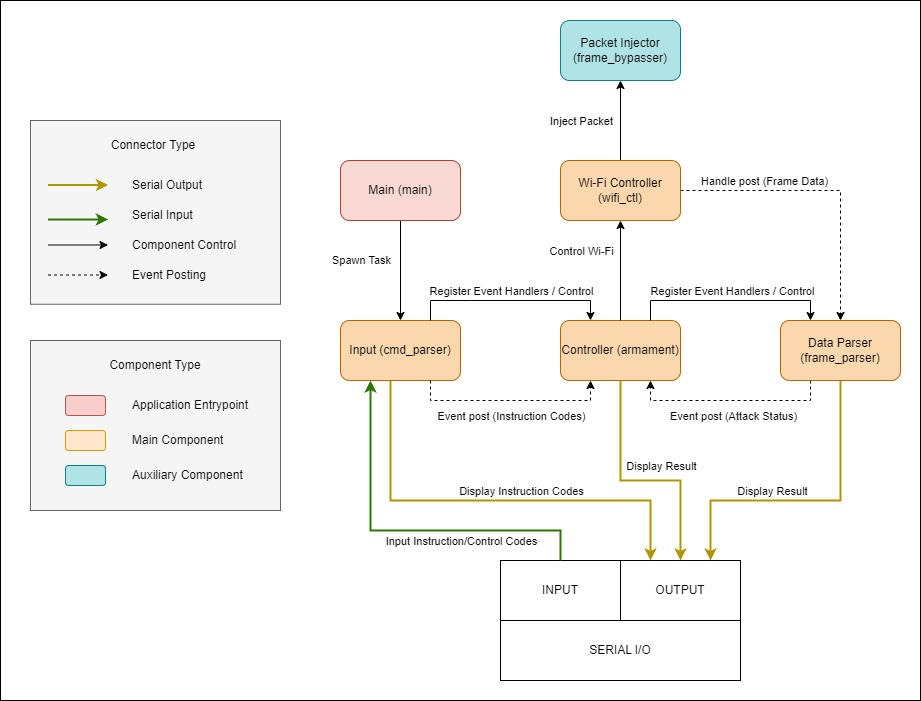

# Wi-Fi penetration ESP32

This software provides a way for user to attack nearby access point using an android device automatically or manually. It harnesses the robust capabilities of the ESP32 microcontroller to execute a vital operation in Wi-Fi network penetration. By capturing key data elements like the PMKID and MIC, it allows users to conduct offline brute force attacks using hashcat to derive the PSK or the password of the target Wi-Fi device. An android device application can be use to automatically control this component, the source code for the android device can be found [here](https://github.com/johndeweyzxc/Wi-Fi-Penetration-Android)

## Features

- **PMKID Capture** - captures the PMKID from the first message of the 4-way hanshake
- **MIC Capture** - captures the MIC and the whole EAPOL authentication data from the second message of the 4-way handshake
- **Reconnaissance** - scans nearby AP and outputs the SSID, channel and RSSI of the AP
- **Deauth** - injects deauthentication frames to terminate connection between the STA and the AP

## Architecture

#### The software consists of 4 main components, an application entrypoint and one auxiliary component.

- **main** The application's entry point initiates the spawning of the command input parser task
- **cmd_parser** It conducts a scan and parsing process of the user input, subsequently forwarding the parsed instruction code to the armament system
- **armament** It orchestrates the attack by controlling the Wi-Fi behavior and the data parser
- **wifi_ctl** An interface for the management of Wi-Fi capabilities such as enabling monitor mode and connecting to the access point
- **frame_parser** Analyzes incoming data frames received from the Wi-Fi controller to identify PMKID and MIC
- **frame_bypasser** An auxiliary component to allow the injection of arbitrary frames

## ESP32 in combination with an Android device

- **[1] Android Phone** Android device that can be use as an interface to control the ESP32
- **[2] USB OTG** Enables communication between the Android device and USB
- **[3] Micro USB Male to USB Male** Establishes connection between the ESP32 device and USB OTG
- **[4] ESP32** Execute attacks by receiving commands from the Android device

## Disclaimer

The project is intended for educational purposes, with the primary goal of raising awareness and understanding of cybersecurity in a legal and ethical context. It is essential to clarify that this tool is NOT INTENDED to encourage or promote any form of unauthorized or unethical hacking activities. Ethical hacking, conducted with proper authorization and consent, plays a crucial role in enhancing the security of digital systems. This project seeks to promote responsible use of technology and responsible disclosure of vulnerabilities to help protect and secure digital environments.

USAGE OF ALL TOOLS on this project for attacking targets without prior mutual consent is ILLEGAL. It is the end user’s responsibility to obey all applicable local, state, and federal laws. I assume no liability and are not responsible for any misuse or damage caused by this project or software.

## More Information

- https://en.wikipedia.org/wiki/PBKDF2
- https://www.wifi-professionals.com/2019/01/4-way-handshake
- https://hashcat.net/forum/thread-7717.html
- https://hashcat.net/wiki/doku.php?id=cracking_wpawpa2
- https://stackoverflow.com/questions/12018920/wpa-handshake-with-python-hashing-difficulties
- https://www.candelatech.com/downloads/802.11-2016.pdf
